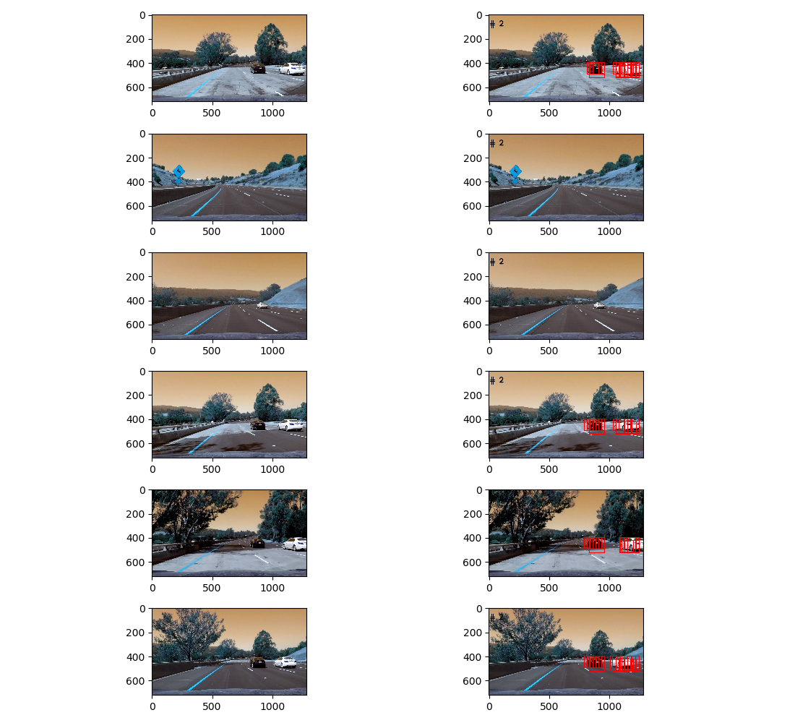
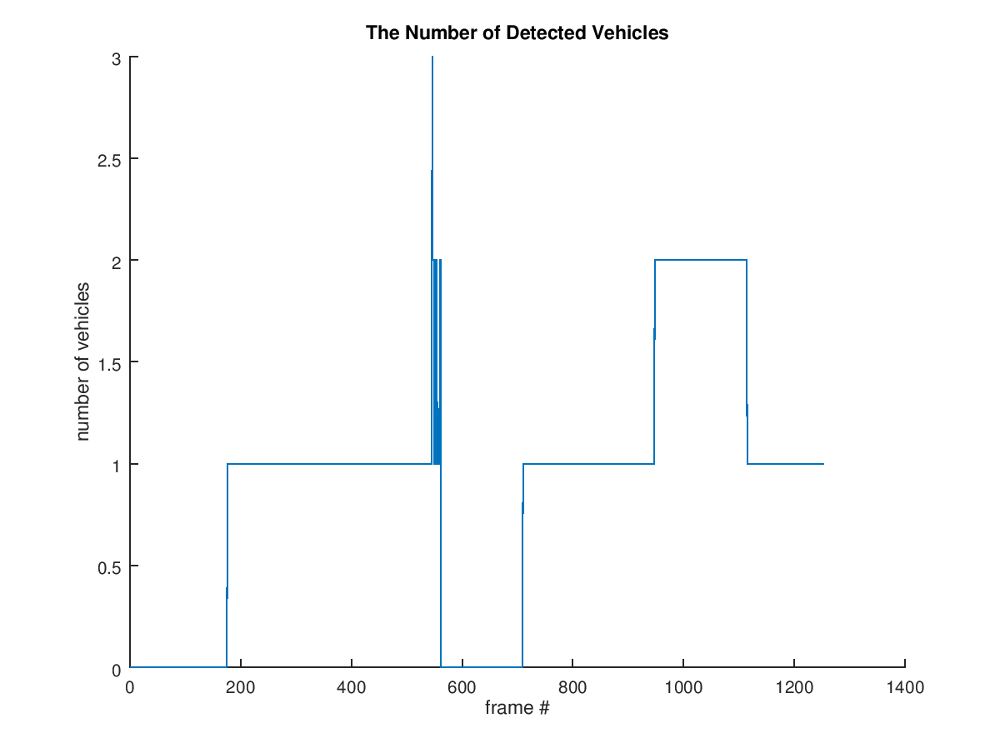
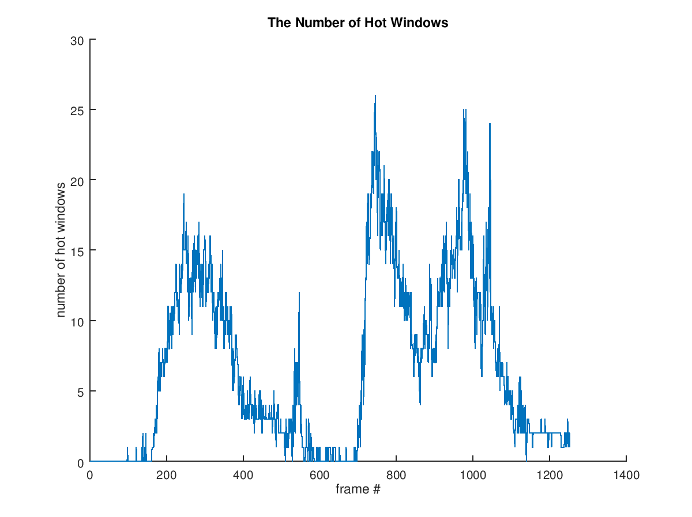
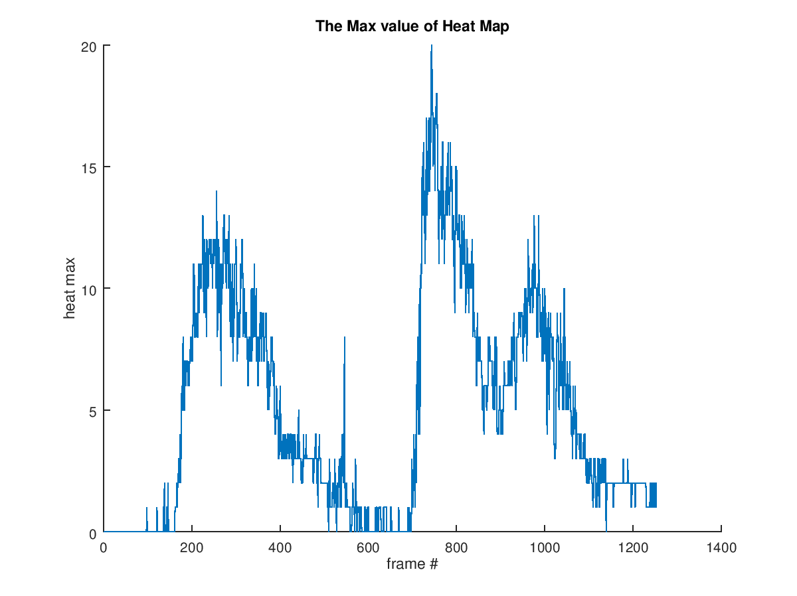

# Udacity SDC Vehicle Tracking

## Input

`project_video.mp4` RGB 1253 frames (25 fps)

## Output

See `output.avi`. Red bounding boxes show the detected vehicle positions.

## Code

The main modules are

  * `vt.colorspace` - contains a single function `vt.colorspace.change` that can be used to convert an image from one color space to another
  * `vt.features` - contains functions to calculate features (histograms, spatial binning, HOG)
  * `vt.normalize` - normalizes features using `sklearn.preprocessing.StandardScaler`
  * `vt.kitti` - contains helpers to load car and not-car images
  * `vt.subsampling` - calculates coords of sliding windows
  * `vt.heatmap` - calculates Heat Map
  
## Scripts

  * `dataset.py` - extracts features, normalizes them (using `sklearn.preprocessing.StandardScaler`), shuffles them, and stores them as HDF5 file (`dataset.h5` by default). `dataset.py` saves some parameters like `scaler` and `features_color_space` to `params.pickle`
  * `train_svc.py` - trains SVC using `dataset.h5`. `train_svc.py` splits input data to training and validation parts
  * `pipeline.py` - contains pipeline implementation. The pipeline uses the output of `train_svc.py` and `params.pickle`
  * `oneshot.py` - helps to check pipeline on test images

## Features

`vt.features.extract` extracts features from images.

I decided to use YCbCr color space based on the following [article](http://ieeexplore.ieee.org/document/5651637/?reload=true).

Here is a list of features I used:

  * color histograms with `64` bins
  * spatial features with spatial size `32x32`
  * HOG features: orient `11`, pixels per cell `8`, cells per block `2`
  
The parameters (like bins count for histogram) were chosen experimentally. The classifier shows the accuracy of `0.98` on the test set (the test set consists of 20% of the data). 

  
## Classifier

I used `LinearSVC` as it was enough to reach the acceptable level of accuracy. See `train_svc.py` for more details.

I tried various values of the `C` parameter including 1, 10, 50, 100, but I did not notice any difference. I decided to pick `C = 100`. 

I also used thresholding the decision function with the threshold of 0.7 to minimize false positives.

The result of classification could be seen below (red squares are the windows which were classified as windows with cars):

  

## Pipeline

The pipeline "slides" though a frame using windows of the fixed size. The classifier decides whether a window contains a car or not (see `vt.subsampling` module). Each frame is zoomed out multiple times before applying the classifier. Scale factors 4.0, 2.5, 2.0, and 1.5 are used in turn, 
the overlapping is 0.5. These scale factors were choosed to "maximize" the accuracy of classification and to "maximize" the performance.

Only a part of the frame is used as an area of interest where cars could be found as there are no cars in the sky (at least today).

The pipeline calculates heat map based on the found candidate windows. The final decision is based on heat map.

The implementation can be found in `pipeline.Pipeline.__call__`.

### Stabilization

The classifier can be wrong. In order to reduce the number of false positives the final decision is based on information that comes
from several frames. The final heat map is a sum of heat maps of the last 25 frames (it is about 1 second of the video). 
All the pixels with the heat map value less then `30` (that's the chosen threshold value) are dropped to zero. See `pipeline.Pipeline.heatmap` and `pipeline.Pipeline.__call__` for more details.

This approach helps to reduce the count of false positives but doesn't eliminate the completely (frame #549, see the metrics below). 

### Conclusions

The resulting pipeline is far from perfect. The pipeline is not bad at detecting cars close to the camera, but it misses them as the distance grows.
 

## Metrics

`pipeline.py` collects additional metrics per frame:

  * `carn` - the count of the detected cars
  * `windowsn` - the count of the "hot windows" (I mean the windows that contain cars according to the classifier)
  * `heatmin`, `heatmean`, `heatmax` - min, mean, and max of the heat map of the current frame
  * `rheatmin`, `rheatmean`, `rheatmax` - same as `heat*`, but for the resulting heat map

The examples of the metrics:

  
  
The image shows that pipeline erroneously finds the third car near frame #550.

  
  
  

## Possible Improvements

  * improve the accuracy of the classifier using more data (augmentation can possibly help)
  * use another classifier: Decision Tree, DNN, etc.
  * improve the stabilization algorithm: the simple summation doesn't seem to be the best choice
